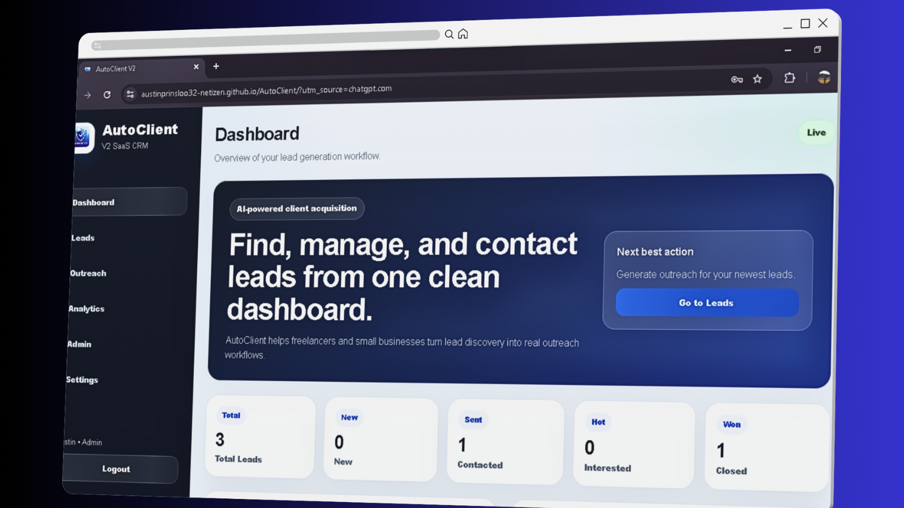

# 🚀 AutoClient V2



Production-ready SaaS CRM platform built for freelancers, agencies, startups, and small businesses.

AutoClient V2 helps users manage leads, generate AI-powered outreach messages, track CRM workflows, manage subscriptions, and streamline client acquisition from a modern SaaS dashboard.

---

# 🌐 Live Demo

## Frontend
https://austinprinsloo32-netizen.github.io/AutoClient/

## Full SaaS Deployment
https://autoclient-v2.onrender.com

---

# ✨ Features

## 🔐 Authentication System
- User registration and login
- Secure authentication flow
- Persistent user sessions
- Protected dashboard experience
- Admin role handling

---

## 📋 CRM Lead Management
- Add, edit, and manage leads
- Lead status tracking
- CRM workflow organization
- Cold, warm, and hot lead priority system
- Follow-up management
- Recent activity tracking

---

## 🤖 AI Outreach Generator
- AI-generated outreach messaging
- Faster prospect communication
- Multiple outreach styles
- Outreach workflow assistance

---

## 💬 WhatsApp + LinkedIn Outreach
- Direct outreach launching
- Multi-platform workflow support
- Streamlined communication tools

---

## 📊 Analytics Dashboard
- Lead status analytics
- Outreach activity tracking
- CRM workflow insights
- Conversion-focused metrics
- Chart.js visual dashboards

---

## 📌 Kanban CRM Pipeline
- Visual sales workflow system
- Drag-and-track CRM pipeline
- Organized lead progression
- Better workflow management

---

## 💳 SaaS Billing Infrastructure
- Stripe Checkout integration
- Stripe Billing Portal
- Subscription management
- Feature-gated Pro plan
- Webhook-driven subscription syncing
- PostgreSQL subscription persistence
- Automated billing workflows

---

## 👨‍💼 Admin Dashboard
- Platform-wide lead overview
- User monitoring system
- Admin-only dashboard
- CRM activity monitoring
- Subscription visibility

---

## 📤 Export Tools
- CSV lead export
- Reporting workflow support
- Data backup support

---

## 📱 Responsive SaaS UI
- Mobile responsive interface
- Modern SaaS dashboard design
- Dark mode support
- Responsive layouts
- Production-style UI/UX

---

# 🛠️ Tech Stack

## Frontend
- HTML5
- CSS3
- JavaScript
- Chart.js

## Backend
- Python
- Flask
- Flask-CORS
- Stripe API
- Stripe Webhooks

## Database
- PostgreSQL
- SQLite fallback for local development

## Infrastructure & Deployment
- Render
- GitHub
- GitHub Pages
- Environment Variables

## Tools & Services
- Git
- GitHub
- Stripe
- PostgreSQL Cloud Hosting
- Render Cloud Hosting

---

# 🏗️ SaaS Architecture

```text
Frontend (HTML/CSS/JavaScript)
            ↓
Flask Backend API
            ↓
PostgreSQL Database
            ↓
Stripe Billing + Webhooks
```

AutoClient V2 uses a production-style SaaS architecture with frontend UI, backend API logic, PostgreSQL persistence, Stripe billing infrastructure, and webhook-based subscription syncing.

---

# 📸 Screenshots

## Dashboard


## Leads CRM


## Analytics Dashboard


## Settings & Billing


## Admin Dashboard


---

# ⚙️ Installation

## Clone Repository

```bash
git clone https://github.com/Austinprinsloo32-netizen/AutoClient.git
```

## Navigate Into Project

```bash
cd AutoClient
```

---

# 🐍 Create Virtual Environment

## Windows

```bash
python -m venv venv
venv\Scripts\activate
```

## Mac/Linux

```bash
python3 -m venv venv
source venv/bin/activate
```

---

# 📦 Install Dependencies

```bash
pip install -r requirements.txt
```

---

# ▶️ Run Backend

```bash
python app.py
```

---

# 🗄️ Database

AutoClient V2 uses PostgreSQL for persistent cloud-based storage.

Example environment variables:

```env
DATABASE_URL=your_postgresql_url
SECRET_KEY=your_secret_key
STRIPE_SECRET_KEY=your_stripe_secret
STRIPE_WEBHOOK_SECRET=your_webhook_secret
STRIPE_PRO_PRICE_ID=your_price_id
```

---

# 💳 Billing Workflow

```text
User clicks Upgrade
        ↓
Stripe Checkout opens
        ↓
Payment succeeds
        ↓
Stripe webhook triggers
        ↓
Flask backend updates PostgreSQL
        ↓
User receives Pro access
```

The Stripe Billing Portal allows users to:
- Manage cards
- View invoices
- Cancel subscriptions
- Manage billing securely

---

# 🚀 Deployment

## Frontend
Hosted on GitHub Pages.

## Backend
Hosted on Render.

## Database
Cloud PostgreSQL integration.

## Billing
Stripe Checkout + Billing Portal + Webhooks.

---

# 🎯 What This Project Demonstrates

AutoClient V2 demonstrates:

- Full-stack web development
- SaaS architecture
- Stripe payment integration
- PostgreSQL database management
- Authentication systems
- API integration
- CRM workflow engineering
- Feature gating systems
- Production deployment
- Responsive UI/UX design
- Admin dashboard systems

---

# 📈 Future Roadmap

## Planned Future Improvements
- 🤖 AI CRM assistant
- 👥 Team workspaces
- 🏢 Agency mode
- 📧 Advanced email automation
- 📊 Advanced analytics
- 🎯 AI lead scoring
- 🔔 Smart notification system
- 🌐 Chrome extension integration
- 📱 Mobile application

---

# 🧠 Project Vision

AutoClient V2 was built to move beyond a simple CRUD application and simulate a real-world SaaS product experience.

The goal was to combine:

- CRM functionality
- AI-powered productivity
- SaaS workflows
- Billing infrastructure
- Cloud deployment
- Modern UI/UX
- Business automation

into one scalable portfolio-grade platform.

---

# 🧪 Current Status

✅ Production deployed  
✅ PostgreSQL integration complete  
✅ Stripe subscription billing active  
✅ Billing management portal active  
✅ Feature-gated SaaS plans  
✅ Admin dashboard operational  
✅ Responsive SaaS UI complete  
✅ Authentication system active  
✅ CRM workflow system operational  
✅ Analytics dashboard operational  
✅ Kanban CRM pipeline active  

---

# 👨‍💻 Developer

## Austin Prinsloo

Aspiring Full-Stack Developer & SaaS Builder from South Africa 🇿🇦

## Portfolio
https://austinprinsloo32-netizen.github.io/Portfolio/

## GitHub
https://github.com/Austinprinsloo32-netizen

## LinkedIn
https://linkedin.com/in/austin-prinsloo-924b91218

---

# 📄 License

This project is licensed under the MIT License.

---

# ⭐ Support The Project

If you like this project:
- Star the repository
- Share the project
- Connect on LinkedIn
- Provide feedback

---

# 💡 Inspiration

AutoClient V2 was inspired by modern CRM and outreach platforms such as:
- HubSpot
- Apollo.io
- Pipedrive
- Notion

while focusing on accessibility, automation, and SaaS workflow simplicity for freelancers and small businesses.